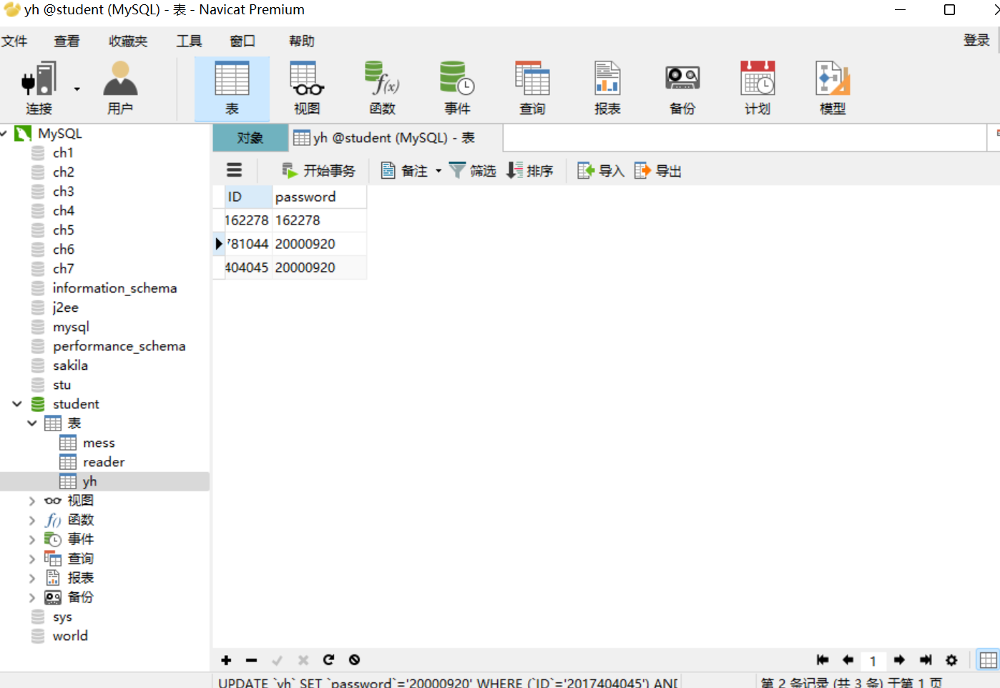

# Library-Management-System
SDWZ.JAVA.Library-Management-System(图书管理系统)，留给后来的学弟学妹。

这是我学Java的时候的代码 里面写得也很随便 只要克隆下去 改一下连接MySQL部分的代码 再把JDBC驱动引入库就好了

这是我MySQL的部分：

JDBC驱动入库参考：https://blog.csdn.net/shuwanghong/article/details/79939172